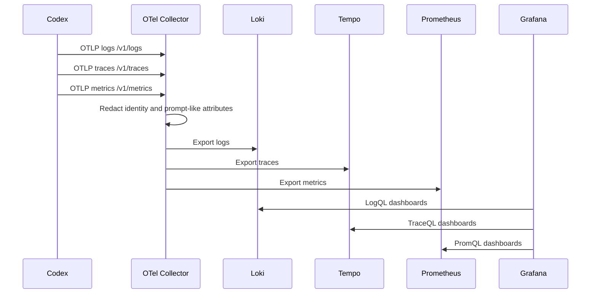

# Architecture and Operations

This document explains the design decisions, runtime flow, privacy controls, and
operational model for the local Codex observability stack.

## Components

| Component | Purpose | Local endpoint |
| --- | --- | --- |
| Codex CLI/Desktop | Emits OpenTelemetry logs, traces, and metrics | n/a |
| OpenTelemetry Collector | Receives OTLP and routes each signal | `4317`, `4318` |
| Loki | Stores structured logs | internal |
| Tempo | Stores traces and generates spanmetrics | internal |
| Prometheus/Mimir-compatible store | Stores metrics | internal |
| Grafana | Dashboards and Explore UI | `3000` |

The `grafana/otel-lgtm` image bundles these components into one Docker
container. Grafana documents the image as a development, demo, and testing
backend, not a production observability platform.

## Signal Flow



## Why User-Level Codex Config

The working telemetry configuration is in:

```text
%USERPROFILE%\.codex\config.toml
```

That scope matters because OpenTelemetry routing is a user-level Codex setting.
A project-local `.codex/config.toml` is not the right place to route Codex's
global telemetry exports.

## Correct OTel Shape

Use inline exporter tables:

```toml
[otel]
environment = "local"
log_user_prompt = false
exporter = { otlp-http = { endpoint = "http://localhost:4318/v1/logs", protocol = "binary" } }
trace_exporter = { otlp-http = { endpoint = "http://localhost:4318/v1/traces", protocol = "binary" } }
metrics_exporter = { otlp-http = { endpoint = "http://localhost:4318/v1/metrics", protocol = "binary" } }
```

This follows the OpenAI Codex OpenTelemetry configuration pattern where the
exporter selection also carries endpoint metadata.

## Privacy Controls

There are two layers:

1. Codex config:
   - `log_user_prompt = false`
   - Raw user prompt contents are not exported unless explicitly enabled.

2. Collector transform processor:
   - Drops `user_email`
   - Drops `user_account_id`
   - Drops `user.email`
   - Drops `user.account_id`
   - Drops `user_prompt`
   - Drops `prompt`

The collector processor is in:

```text
observability\otelcol-config.yaml
```

This protects future data. It does not rewrite records already stored in Loki,
Tempo, or the persisted Docker volume.

## Dashboard Provisioning

Dashboard creation is idempotent:

```powershell
.\observability\setup-codex-dashboards.ps1
```

The script uses Grafana's HTTP API and overwrites the dashboards in the
`Codex Observability` folder. This is preferable to manual UI-only changes
because it makes the setup repeatable and reviewable in Git.

## Label and Query Model

The verified local LGTM/Loki setup stores `service_name` as the reliable stream
selector:

```logql
{service_name="Codex Desktop"}
```

Fields such as `event_name`, `event_kind`, and token counts behave as structured
metadata and should be queried with pipeline filters:

```logql
{service_name="Codex Desktop"} | event_name="codex.sse_event" | event_kind="response.completed"
```

Tempo uses:

```traceql
{ resource.service.name = "Codex Desktop" }
```

Prometheus spanmetrics use:

```promql
traces_spanmetrics_calls_total{service="Codex Desktop"}
```

## Operational Checks

Container:

```powershell
docker ps --filter "name=^/codex-otel-lgtm$"
```

Grafana API:

```powershell
Invoke-RestMethod http://localhost:3000/api/health
```

Codex config:

```powershell
codex doctor
```

Smoke event:

```powershell
codex exec "Say only: otel smoke test"
```

## Security Notes

This setup is for localhost. Before exposing it beyond your machine:

- Change Grafana credentials.
- Put Grafana behind authentication and TLS.
- Restrict OTLP ports to trusted clients.
- Review all telemetry labels for sensitive data.
- Define retention and deletion procedures.
- Avoid sending local telemetry to a public endpoint without explicit review.

## Best Practices Used

- Configuration as code for the collector and dashboards.
- Idempotent provisioning scripts.
- Local-only default endpoints.
- Prompt logging disabled at source.
- Identity redaction before storage.
- Separate dashboards for logs, traces, metrics, and token economics.
- Explicit smoke tests and direct backend queries.
- Clear limitations for non-production use.
