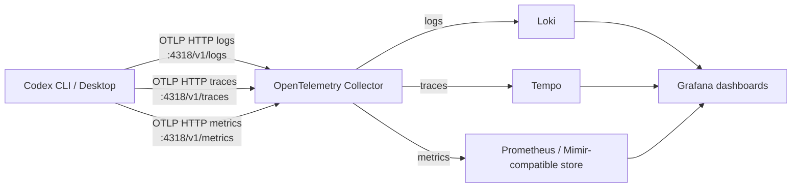

# Codex Observability with Local OpenTelemetry and Grafana

This guide shows how to run a local, self-managed observability stack for OpenAI
Codex using Docker Desktop, Grafana LGTM, and OpenTelemetry.

The goal is simple: when Codex runs locally, you should be able to see logs,
traces, operational metrics, and token economics without sending telemetry to a
third-party SaaS backend.

## What We Built

Local endpoints:

- Grafana: `http://localhost:3000`
- OTLP/HTTP: `http://localhost:4318`
- OTLP/gRPC: `localhost:4317`

## Dashboard Set

- `Codex / Loki Logs`: event drilldown, warnings/errors, token-bearing log records
- `Codex / Tempo Traces`: trace search, span rate, p95 latency, service graph
- `Codex / Prometheus Metrics`: collector health and Tempo-generated spanmetrics
- `Codex / Token Economics`: input, output, cached, reasoning, and tool tokens

## Why This Setup Matters

For builders, observability is not only about errors. A useful Codex dashboard
answers practical questions:

- Which runs are slow?
- Which tool calls dominate elapsed time?
- Which model/provider is being used?
- How many tokens are consumed per completion?
- How much context is cached?
- Are traces/logs/metrics actually arriving?
- Is any sensitive prompt or identity data being stored?

## Start Here

1. Follow the [Manual Rebuild Guide](rebuild-guide.md).
2. Review [Architecture and Operations](architecture-and-operations.md).
3. Review [Builder Metrics and Token Economics](builder-metrics.md).
4. Publish the docs using [Publishing to GitHub Pages](publishing.md).

## Source References

- OpenAI Codex OpenTelemetry:
  <https://developers.openai.com/codex/config-advanced#open-telemetry>
- OpenAI Codex config reference:
  <https://developers.openai.com/codex/config-reference#otel>
- OpenAI Codex local providers:
  <https://developers.openai.com/codex/config-advanced#oss-mode-local-providers>
- Grafana LGTM Docker image:
  <https://github.com/grafana/docker-otel-lgtm>
